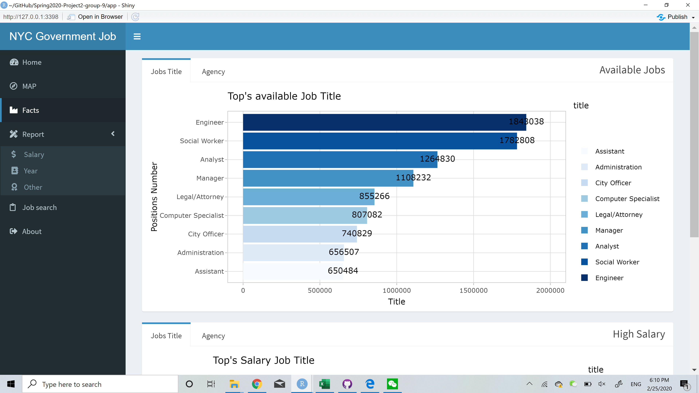
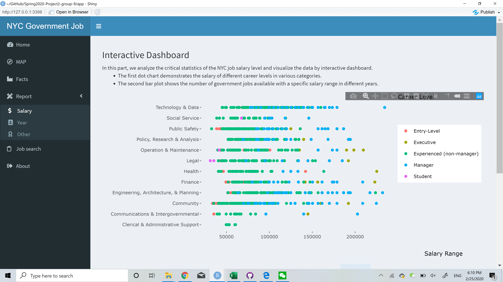
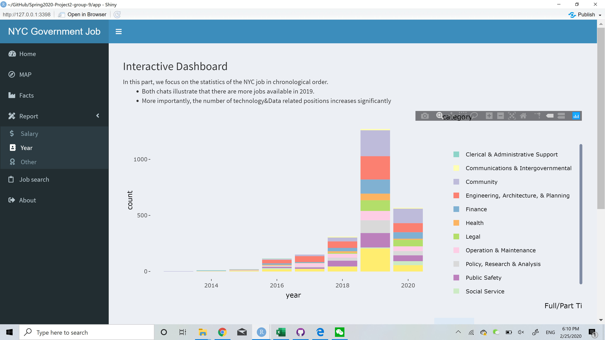
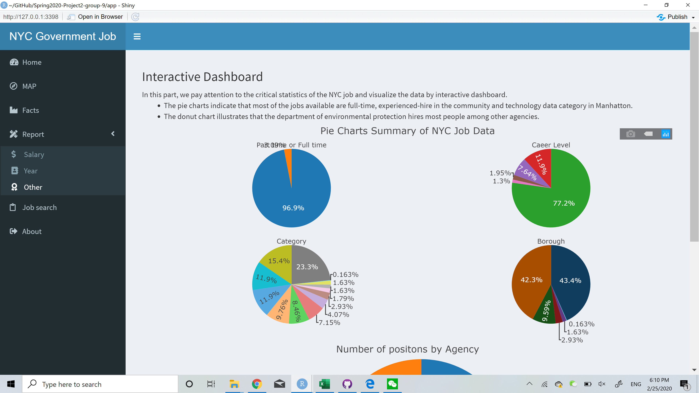
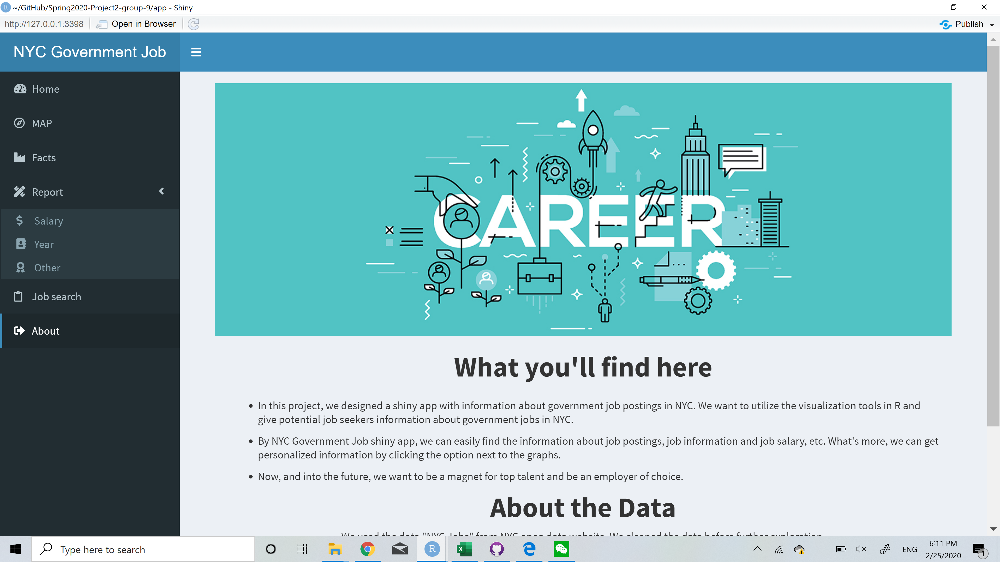

# Project 2: Shiny App Development Version 2.0














## NYC Government Job MAP And More（https://rrl525.shinyapps.io/NYC-Government-Job/）
Term: Spring 2020

**Team Members**: 
+ Team #9
+  Team members
	+ Chen, Shuyi
	+ Li, Jia
	+ Lu, Ran
	+ Shi, Mengying (Presenter)
	+ Walters, Ryan
	+ Zhang, Zhiyuan

+ **Project summary**: 

The project develops a Shiny App with information about government job postings in NYC.  In particular, we further analyze the working location, salary and job categories that draw the attention of potential job seekers. This App can not only provide job seekers with useful information during their job hunting period but also generalize the job market trend for college students in NYC. We hope to support potential job seekers' information about government jobs in NYC.

+ **Contribution statement**: 
 
Five group members(Ran Lu, Mengying Shi, Zhiyuan Zhang, Shuyi Chen, Jia Li) except Ryan Walters contribute equally to the group project.

Ran Lu carried out data pre-processing, designed and developed the map, and added informative and interesting filters to complete the shiny structure. Built the job search page with Mengying Shi.

Mengying Shi is the presenter of our group. She designed and built Home Page and About Page, created a colorful and informative home page. Built the job search page with Ran Lu.

Zhiyuan Zhang aggregated and subsetted original dateaset.  Built and developed the interactive statistical analysis part. Contribute to the text part of About Page.

Shuyi Chen further extracted and aggredate data. Built and developed the interactive statistical analysis part. Wrote the project summary and readme statement.

Jia Li analyzed and extracted data from the original dataset. Designed and developed the facts page of the shiny app.

Ryan Walters participated in the brainstorming.

All team members approve our work presented in our GitHub repository including this contribution statement.

Following [suggestions](http://nicercode.github.io/blog/2013-04-05-projects/) by [RICH FITZJOHN](http://nicercode.github.io/about/#Team) (@richfitz). This folder is orgarnized as follows.

```
proj/
├── app/
├── lib/
├── data/
├── doc/
└── output/
```

Please see each subfolder for a README file.

